### Hello

I'm Emmanouil Karystinaios, a Post-Doctoral Researcher in Music Information Retrieval.

Currently, I work on automatic music analysis with Graph Neural Networks (GNNs), Optical Music Recognition, and Generative Music Medicine, exploring the use and controllability of AI-generated music in therapeutic contexts.

---

### Recent GitHub Activity

<!--START_SECTION:activity-->
1. 🎉 Merged PR [#6](https://github.com/manoskary/analysisgnn/pull/6) in [manoskary/analysisgnn](https://github.com/manoskary/analysisgnn)
2. ℹ️ Assigned PR [#6](https://github.com/manoskary/analysisgnn/pull/6) in [manoskary/analysisgnn](https://github.com/manoskary/analysisgnn)
3. ℹ️ Assigned PR [#6](https://github.com/manoskary/analysisgnn/pull/6) in [manoskary/analysisgnn](https://github.com/manoskary/analysisgnn)
4. ℹ️ Labeled PR [#6](https://github.com/manoskary/analysisgnn/pull/6) in [manoskary/analysisgnn](https://github.com/manoskary/analysisgnn)
5. 💪 Opened PR [#6](https://github.com/manoskary/analysisgnn/pull/6) in [manoskary/analysisgnn](https://github.com/manoskary/analysisgnn)
<!--END_SECTION:activity-->

---

### GitHub Stats

  

  

---

### Latest Publications

<!-- BLOG-POST-LIST:START -->
- [Voice and Staff Separation in Symbolic Piano Music with GNNs](https://medium.com/data-science/voice-and-staff-separation-in-symbolic-piano-music-with-gnns-0cab100629cf?source=rss-9d63e988ed0c------2)
- [GraphMuse: A Python Library for Symbolic Music Graph Processing](https://medium.com/data-science/graphmuse-a-python-library-for-symbolic-music-graph-processing-40dbd9baf319?source=rss-9d63e988ed0c------2)
- [Perception-Inspired Graph Convolution for Music Understanding Tasks](https://medium.com/data-science/perception-inspired-graph-convolution-for-music-understanding-tasks-4d2ba1be48e7?source=rss-9d63e988ed0c------2)
<!-- BLOG-POST-LIST:END -->
